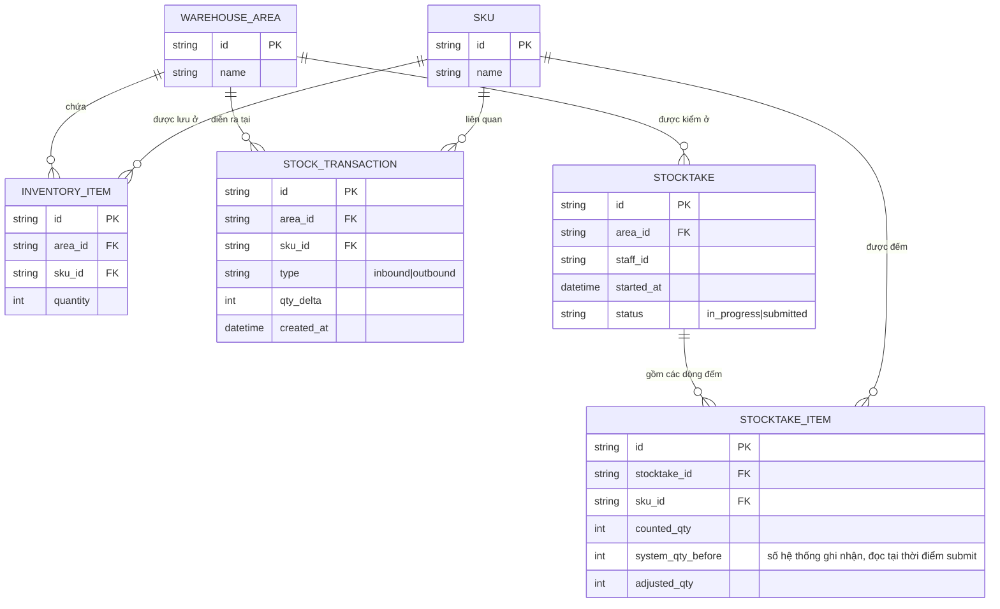

# Base ERD — Quản lý kho có xuất/nhập, chưa có kiểm soát tương tranh cho kiểm kho

Đây là **base**: trạng thái hệ thống quản lý kho *trước khi* áp dụng cơ chế khóa/version cho flow kiểm kho. Suy luận từ đề bài, base đã có `WAREHOUSE_AREA` (khu vực/kệ hàng), `SKU` (mã hàng), `INVENTORY_ITEM` lưu số lượng tồn của 1 SKU tại 1 khu vực cụ thể, và `STOCK_TRANSACTION` ghi lại mọi phiếu xuất/nhập kho làm thay đổi `INVENTORY_ITEM.quantity`. Đã có tính năng `STOCKTAKE` để nhân viên ghi nhận số đếm thực tế, nhưng chưa có bất kỳ khóa hay version check nào — số đếm được ghi đè thẳng vào hệ thống, không đối chiếu với các giao dịch xảy ra trong lúc đếm.

