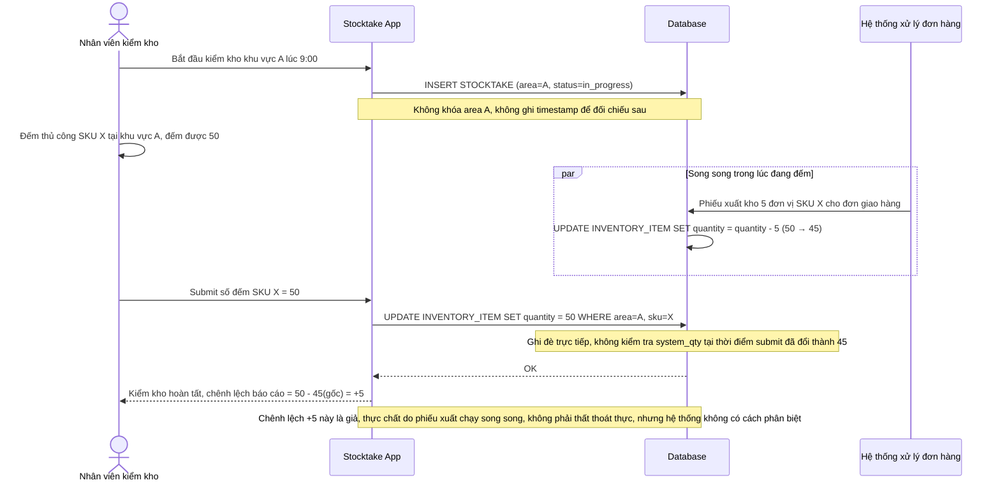

# Base sequence — Stocktake count (không khóa, không đối chiếu, gây chênh lệch giả)

Đây là **base**, flow kiểm kho hiện tại: nhân viên đếm thủ công rồi submit số đếm, hệ thống không chặn giao dịch xuất/nhập nào khác đang chạy song song ở cùng khu vực, cũng không ghi nhận mốc thời gian bắt đầu đếm để đối chiếu sau này. Đây chính là kịch bản mô tả ở yêu cầu 1 của đề bài — nhân viên đếm 50 đơn vị SKU X lúc 9:00, đúng lúc có phiếu xuất 5 đơn vị chạy song song, số đếm 50 bị ghi đè trực tiếp dù hệ thống lúc đó đã là 45, gây báo cáo chênh lệch giả.

