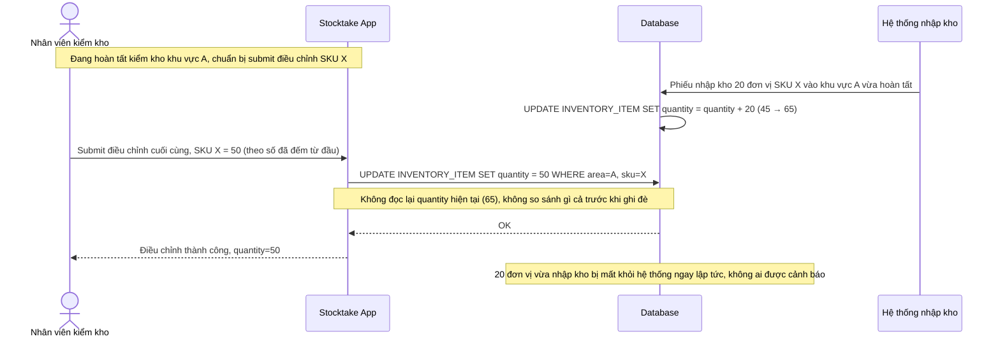

# Base sequence — Submit stocktake adjustment (không version check, ghi đè mù)

Đây là **base**, flow nộp kết quả điều chỉnh sau khi đếm xong: nhân viên xác nhận số liệu cuối cùng và hệ thống ghi đè trực tiếp vào `INVENTORY_ITEM.quantity`, không kiểm tra số liệu tồn kho đã thay đổi kể từ lúc bắt đầu đếm hay chưa. Đây là tiền đề cho yêu cầu 4 của đề bài — khi có giao dịch nhập kho mới hoàn tất đúng lúc nhân viên đang chờ submit, việc ghi đè mù sẽ làm mất luôn số lượng hàng mới nhập.

