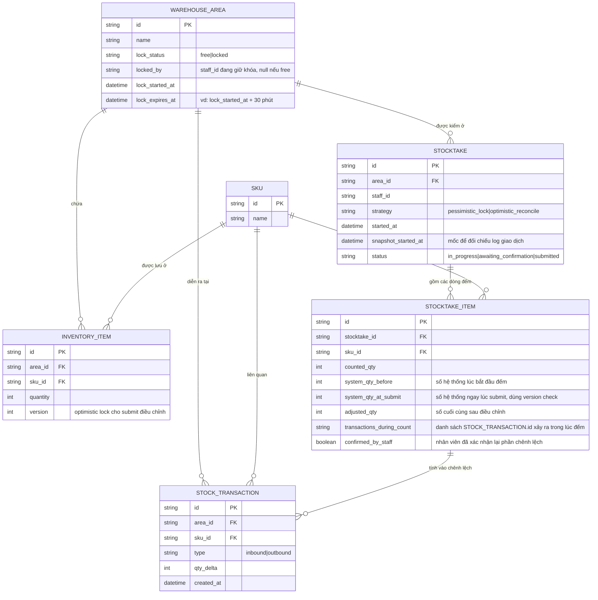

# Enhance ERD — Khóa theo khu vực có giới hạn phạm vi/thời gian, version check, audit trail

Đây là ERD **sau khi** enhance được áp dụng lên base. So với base, thêm các trường/entity sau, ứng trực tiếp với từng yêu cầu:

- `WAREHOUSE_AREA.lock_status`, `locked_by`, `lock_started_at`, `lock_expires_at` — đáp ứng yêu cầu 2 (khóa cứng giới hạn đúng phạm vi khu vực/kệ đang kiểm, có thời gian tối đa giữ khóa, ví dụ 30 phút, kèm cảnh báo khi vượt).
- `STOCKTAKE.strategy` (pessimistic|optimistic), `snapshot_started_at` — đáp ứng yêu cầu 1 (ghi rõ chọn khóa cứng hay ghi nhận mốc thời gian để đối chiếu log sau).
- `INVENTORY_ITEM.version` — đáp ứng yêu cầu 4 (version check khi submit điều chỉnh, phát hiện số liệu đã đổi do giao dịch mới).
- `STOCKTAKE_ITEM` thêm `system_qty_at_submit`, `transactions_during_count` (danh sách `STOCK_TRANSACTION` xảy ra trong lúc đếm), `confirmed_by_staff` — đáp ứng yêu cầu 5 (audit trail đầy đủ số liệu trước/đếm/sau và các giao dịch đã tính vào chênh lệch).
- Khóa (`lock_status`/`locked_by`) được đặt ở cấp `WAREHOUSE_AREA` (vị trí vật lý), không đặt ở cấp `SKU` — đáp ứng yêu cầu 3 (ranh giới khóa theo khu vực, không theo SKU tổng, để 2 khu vực khác nhau đếm cùng SKU không chặn nhau).

