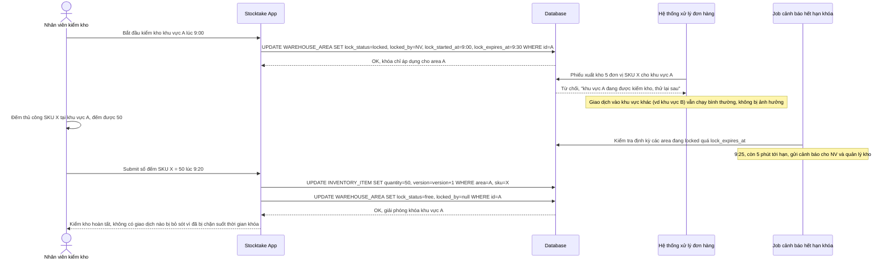

# Enhance sequence — Stocktake count (khóa cứng khu vực, giới hạn phạm vi + thời gian)

Đây là **enhance** của flow `stocktake-count` đã có ở base. So với base (không khóa, ghi đè trực tiếp gây chênh lệch giả), nay hệ thống khóa cứng đúng khu vực A đang kiểm (không khóa toàn kho, không khóa theo SKU), chặn mọi giao dịch xuất/nhập vào khu vực đó trong lúc đếm, và tự động cảnh báo/giải phóng khóa nếu vượt thời gian tối đa cho phép. Đáp ứng yêu cầu 1 (chọn phương án khóa cứng) và yêu cầu 2 (giới hạn phạm vi + thời gian + cảnh báo) của đề bài.

