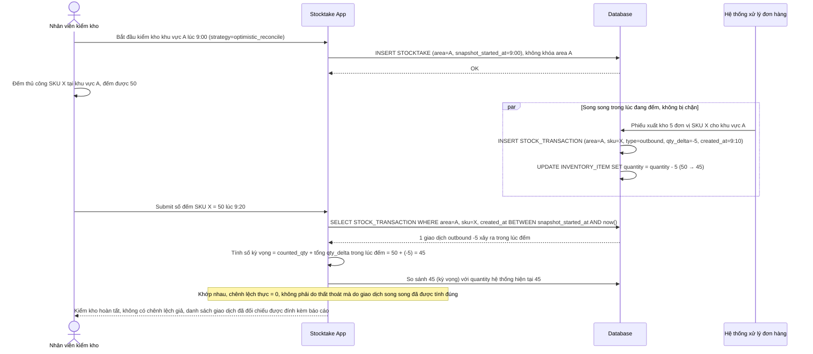

# Enhance sequence — Stocktake count (phương án thay thế: optimistic, timestamp + đối chiếu log)

Đây là **enhance**, phương án thay thế cho flow `stocktake-count` khi tổ chức chấp nhận đánh đổi độ chính xác tuyệt đối để không làm gián đoạn vận hành kho. Thay vì khóa cứng khu vực (xem file `5-enhance-stocktake-count-sqd.md`), hệ thống chỉ ghi nhận `snapshot_started_at`, để mọi giao dịch xuất/nhập vẫn chạy bình thường trong lúc đếm, rồi khi submit sẽ đối chiếu với log `STOCK_TRANSACTION` xảy ra trong khoảng thời gian đếm để tính lại số kỳ vọng đúng. Đáp ứng phần còn lại của yêu cầu 1 (phương án optimistic được đề bài yêu cầu đánh giá song song với khóa cứng).

