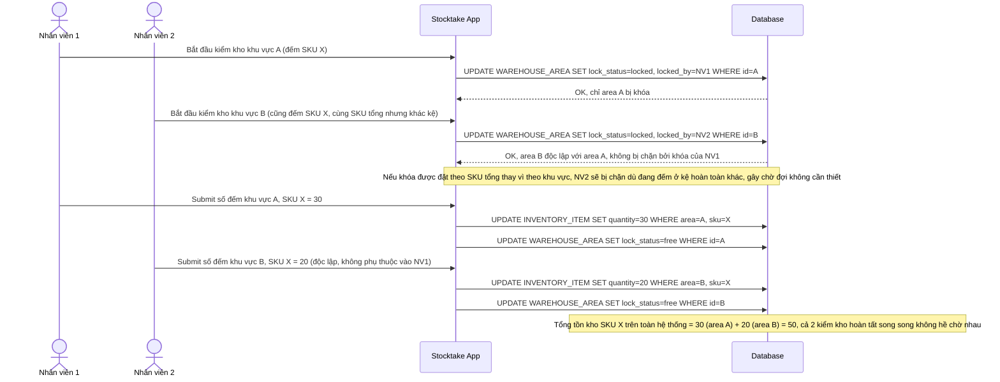

# Enhance sequence — 2 nhân viên kiểm kho khác khu vực nhưng cùng SKU tổng

Đây là **enhance**, flow mới minh họa ranh giới khóa của hệ thống sau khi áp dụng khóa cứng theo khu vực. Hai nhân viên kiểm kho ở khu vực A và khu vực B khác nhau, cùng đếm SKU X (cùng SKU tổng lưu ở 2 kệ khác nhau) — vì khóa đặt ở cấp `WAREHOUSE_AREA` chứ không đặt ở cấp `SKU`, 2 nhân viên không hề chặn lẫn nhau. Đáp ứng yêu cầu 3 của đề bài.

