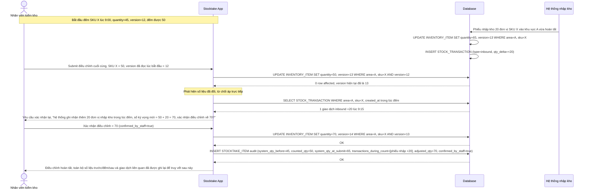

# Enhance sequence — Submit stocktake adjustment (version check + audit trail đầy đủ)

Đây là **enhance** của flow `submit-stocktake-adjustment` đã có ở base. So với base (ghi đè mù, mất luôn hàng vừa nhập), nay hệ thống dùng `INVENTORY_ITEM.version` để phát hiện số liệu tồn kho đã thay đổi kể từ lúc bắt đầu đếm, từ chối áp trực tiếp mà yêu cầu nhân viên xác nhận lại phần chênh lệch, đồng thời ghi đầy đủ audit trail. Đáp ứng yêu cầu 4 và yêu cầu 5 của đề bài.

