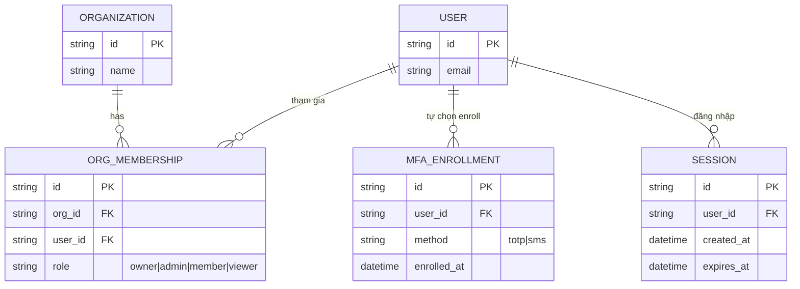

# Base ERD — SaaS multi-tenant chưa có chính sách MFA theo tổ chức

Đây là **base**: trạng thái SaaS quản lý dự án/CRM *trước khi* org admin có thể tự cấu hình chính sách MFA. Suy luận từ đề bài, base đã có `ORGANIZATION` (tenant), `USER` có thể tham gia nhiều tổ chức qua `ORG_MEMBERSHIP` (kèm `role`), và `SESSION` khi user đăng nhập. MFA ở base chỉ tồn tại dưới dạng tùy chọn cá nhân (`MFA_ENROLLMENT`, user tự bật nếu muốn), hoàn toàn không có khái niệm chính sách bắt buộc theo tổ chức hay theo role.

