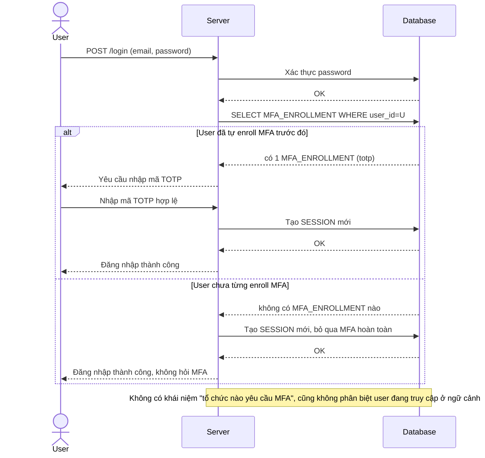

# Base sequence — Login (MFA chỉ là tùy chọn cá nhân, không có chính sách tổ chức)

Đây là **base**, flow đăng nhập hiện tại: hệ thống kiểm tra email/password, sau đó chỉ hỏi MFA nếu chính user đó đã tự nguyện enroll trước đây — không hề tra cứu chính sách của tổ chức mà user đang truy cập. Đây là tiền đề cho toàn bộ đề bài, vì org admin hiện chưa có cách nào ép MFA theo tổ chức của họ.

