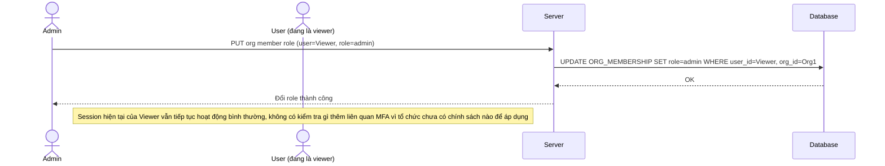

# Base sequence — Change member role (không có tác động MFA vì chưa có chính sách)

Đây là **base**, flow admin đổi role của 1 thành viên trong tổ chức. Ở base, việc đổi role chỉ ảnh hưởng tới quyền truy cập tính năng (permission), hoàn toàn không liên quan gì tới MFA vì tổ chức chưa có chính sách MFA theo role. Đây là tiền đề cho yêu cầu 2 của đề bài.

