# Enhance ERD — Chính sách MFA theo tổ chức, theo role, theo ngữ cảnh session

Đây là ERD **sau khi** enhance được áp dụng lên base. So với base, thêm các entity/trường sau, ứng trực tiếp với từng yêu cầu:

- `ORG_MFA_POLICY` (mới) — đáp ứng yêu cầu 2 và 5 (cấu hình bắt buộc/tắt, phương thức được phép, áp dụng cho role nào, riêng theo từng `ORGANIZATION`).
- `GRACE_PERIOD_TRACKER` (mới) — đáp ứng yêu cầu 1 (grace period giới hạn kèm đếm số lần nhắc nhở tăng dần cho user chưa enroll khi policy vừa bật).
- `SESSION.active_org_context` — đáp ứng yêu cầu 3 (mỗi session gắn với 1 ngữ cảnh org cụ thể, MFA được áp theo đúng policy của org đang active, tránh né qua context org khác lỏng hơn).
- `MFA_POLICY_AUDIT_LOG` (mới) — đáp ứng yêu cầu 4 (ghi log và thông báo khi admin hạ cấp/tắt chính sách, hành động này tự nó cũng yêu cầu MFA).
- `MFA_ENROLLMENT.method` cần khớp `ORG_MFA_POLICY.allowed_methods`, thêm `must_reenroll_by` — đáp ứng yêu cầu 5 (user enroll SMS theo policy cũ phải enroll lại phương thức mới trong mốc thời gian rõ ràng).

```mermaid
erDiagram
    ORGANIZATION ||--o{ ORG_MEMBERSHIP : has
    ORGANIZATION ||--|| ORG_MFA_POLICY : "có chính sách MFA"
    ORGANIZATION ||--o{ MFA_POLICY_AUDIT_LOG : "ghi log thay đổi policy"
    USER ||--o{ ORG_MEMBERSHIP : "tham gia"
    USER ||--o{ MFA_ENROLLMENT : "enroll"
    USER ||--o{ SESSION : "đăng nhập"
    USER ||--o{ GRACE_PERIOD_TRACKER : "đang trong grace period"

    ORGANIZATION {
        string id PK
        string name
    }
    USER {
        string id PK
        string email
    }
    ORG_MEMBERSHIP {
        string id PK
        string org_id FK
        string user_id FK
        string role "owner|admin|member|viewer"
    }
    ORG_MFA_POLICY {
        string org_id PK
        boolean required
        string allowed_methods "vd: webauthn only, hoặc totp+sms"
        string applies_to_roles "vd: [admin, owner]"
        int grace_period_days
        string updated_by FK
        datetime updated_at
    }
    MFA_ENROLLMENT {
        string id PK
        string user_id FK
        string method "totp|sms|webauthn"
        datetime enrolled_at
        datetime must_reenroll_by "hạn enroll lại nếu method cũ không còn được policy mới cho phép"
    }
    GRACE_PERIOD_TRACKER {
        string id PK
        string user_id FK
        string org_id FK
        datetime deadline
        int reminder_count
        datetime last_reminded_at
    }
    MFA_POLICY_AUDIT_LOG {
        string id PK
        string org_id FK
        string action "enable|disable|downgrade|tighten_method"
        string performed_by FK
        datetime performed_at
    }
    SESSION {
        string id PK
        string user_id FK
        string active_org_context FK "org đang active trong phiên này"
        datetime created_at
        datetime expires_at
    }
```

