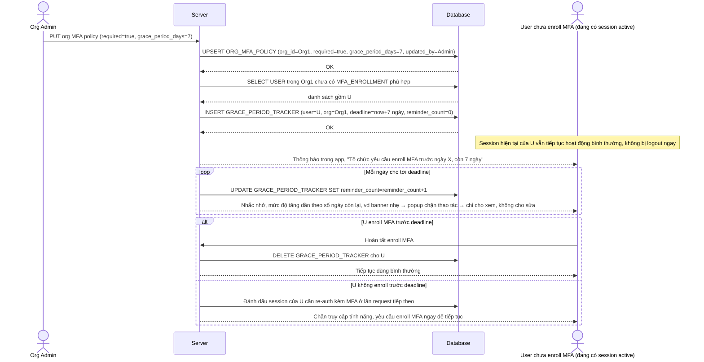

# Enhance sequence — Enable org MFA policy (grace period có giới hạn + nhắc nhở tăng dần)

Đây là **enhance**, flow mới phát sinh từ đề bài — org admin bật chính sách MFA bắt buộc cho toàn tổ chức. Vì user đang có session hoạt động nhưng chưa enroll không thể bị ép logout tức thì (gây gián đoạn hàng loạt) nhưng cũng không thể dùng vô thời hạn, hệ thống tạo `GRACE_PERIOD_TRACKER` với hạn rõ ràng và nhắc nhở tăng dần. Đáp ứng yêu cầu 1 của đề bài.

