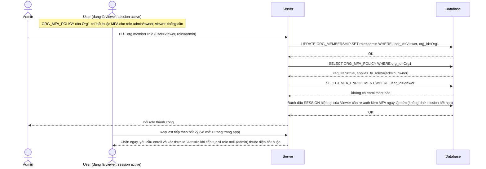

# Enhance sequence — Change member role (chính sách MFA áp dụng ngay, không chờ login lại)

Đây là **enhance** của flow `change-member-role` đã có ở base. So với base (đổi role không ảnh hưởng gì tới MFA), nay khi role thay đổi, hệ thống lập tức tra cứu lại `ORG_MFA_POLICY.applies_to_roles` cho role mới và áp dụng ngay lên session đang hoạt động, không chờ tới lần đăng nhập kế tiếp mới phát hiện ra chưa đủ điều kiện. Đáp ứng yêu cầu 2 của đề bài.

