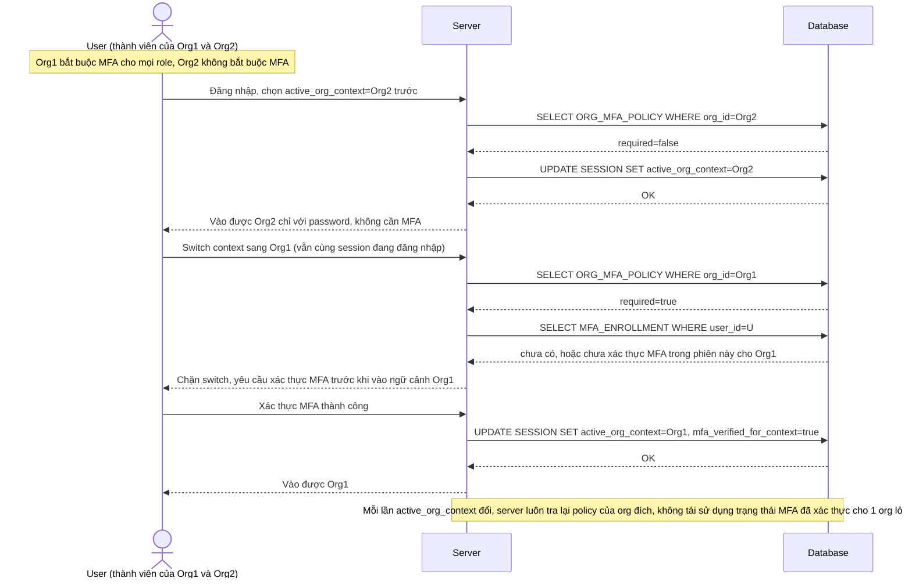

# Enhance sequence — Switch org context (MFA áp theo đúng ngữ cảnh org đang active)

Đây là **enhance**, flow mới phát sinh từ đề bài — user có 1 email tham gia nhiều tổ chức với chính sách MFA khác nhau, chuyển ngữ cảnh làm việc giữa các tổ chức trong cùng phiên đăng nhập. Mỗi lần chuyển, hệ thống đánh giá lại MFA theo đúng `ORG_MFA_POLICY` của org đang được chọn, để user không thể né MFA chặt của 1 tổ chức bằng cách chuyển qua tổ chức khác lỏng hơn rồi vẫn thao tác trên dữ liệu nhạy cảm. Đáp ứng yêu cầu 3 của đề bài.

