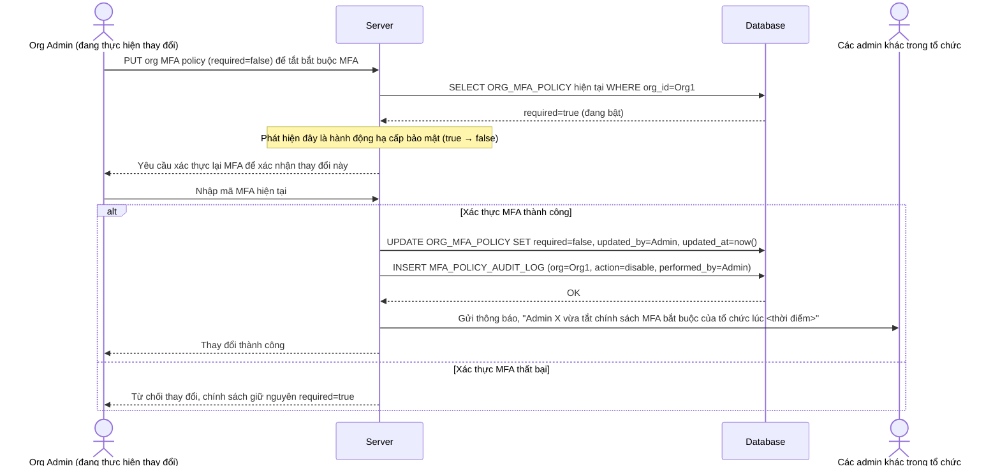

# Enhance sequence — Downgrade org MFA policy (tự yêu cầu MFA + log + thông báo admin khác)

Đây là **enhance**, flow mới phát sinh từ đề bài — org admin hạ cấp hoặc tắt chính sách MFA bắt buộc (vd đổi nhà cung cấp SSO). Vì đây là hành động làm giảm bảo mật toàn tổ chức, chính admin thực hiện phải tự xác thực MFA trước khi đổi được, đồng thời hệ thống ghi log và thông báo cho các admin khác trong tổ chức. Đáp ứng yêu cầu 4 của đề bài.

