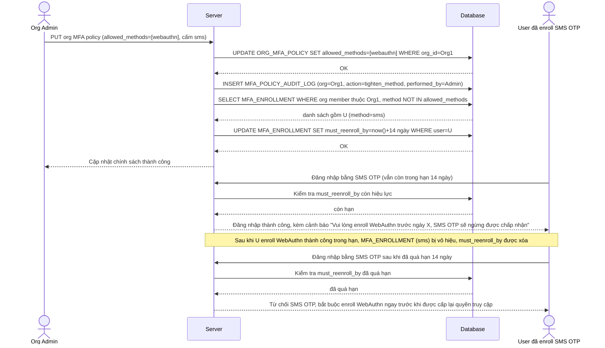

# Enhance sequence — Tighten MFA method policy (buộc enroll lại phương thức mới, có thời hạn)

Đây là **enhance**, flow mới phát sinh từ đề bài — org admin siết chính sách sang chỉ cho phép 1 phương thức MFA chặt hơn (vd chỉ WebAuthn, cấm SMS OTP). Những user đã enroll SMS theo chính sách cũ được cấp thời hạn rõ ràng để enroll lại, không bị mất quyền truy cập ngay khi chính sách vừa đổi. Đáp ứng yêu cầu 5 của đề bài.

