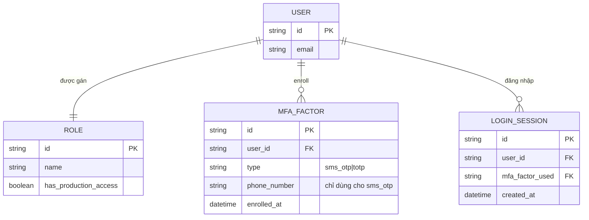

# Base ERD — Console nội bộ DevOps, MFA đa dạng phương thức chưa phân biệt độ mạnh

Đây là **base**: trạng thái bảng điều khiển nội bộ DevOps *trước khi* bắt buộc hardware security key cho tài khoản đặc quyền. Suy luận từ đề bài, base đã có `USER` (kỹ sư SRE/DevOps), `ROLE` xác định ai có `has_production_access`, và `MFA_FACTOR` cho phép enroll nhiều loại phương thức (kể cả SMS OTP) mà không phân biệt độ mạnh — chỉ cần có 1 factor bất kỳ là đủ để login, không quan tâm tài khoản có quyền production hay không.

