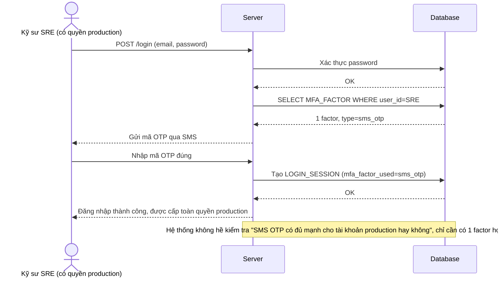

# Base sequence — Login with MFA (mọi phương thức được chấp nhận như nhau, kể cả SMS OTP)

Đây là **base**, flow đăng nhập hiện tại: hệ thống chấp nhận bất kỳ `MFA_FACTOR` nào user đã enroll, kể cả SMS OTP, dù tài khoản có quyền truy cập production hay không. Đây là tiền đề cho yêu cầu 1 của đề bài — hiện tại chưa có sự phân biệt độ mạnh giữa các phương thức MFA.

