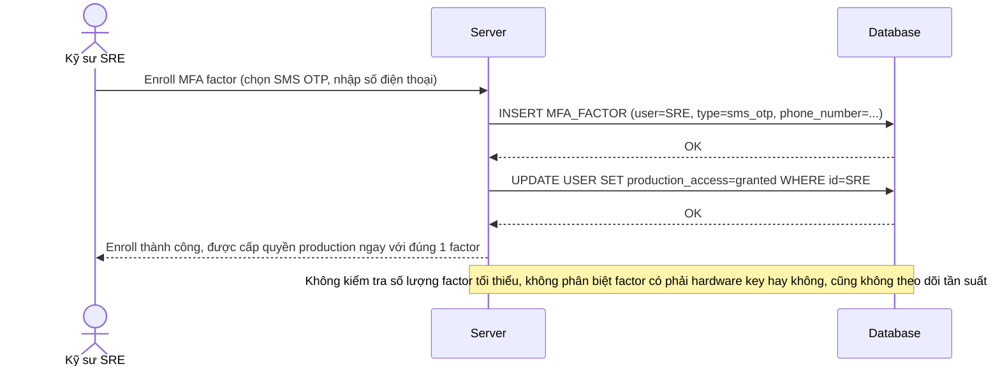

# Base sequence — Enroll MFA factor (chỉ cần 1 factor duy nhất, không phân biệt loại)

Đây là **base**, flow enroll MFA hiện tại: kỹ sư chỉ cần đăng ký 1 phương thức bất kỳ là được cấp quyền production ngay, không yêu cầu số lượng tối thiểu hay loại phương thức cụ thể. Đây là tiền đề cho yêu cầu 2 của đề bài (chưa có ràng buộc tối thiểu 2 key) và gián tiếp liên quan yêu cầu 5 (chưa có giám sát tần suất enroll).

