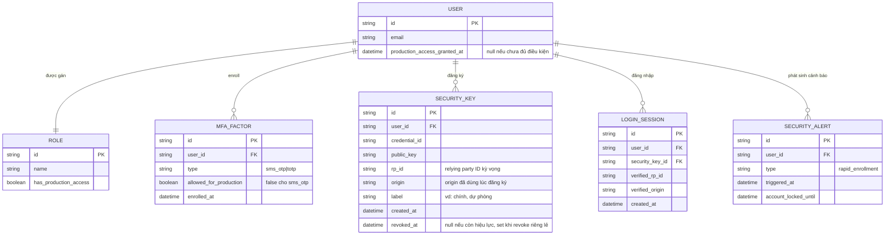

# Enhance ERD — WebAuthn/FIDO2 bắt buộc, tối thiểu 2 key, revoke riêng lẻ, cảnh báo bất thường

Đây là ERD **sau khi** enhance được áp dụng lên base. So với base, thay `MFA_FACTOR` chung chung bằng entity chuyên biệt `SECURITY_KEY` cho WebAuthn, và thêm các entity/trường sau, ứng trực tiếp với từng yêu cầu:

- `MFA_FACTOR.allowed_for_production` (false với `sms_otp`) — đáp ứng yêu cầu 1 (chặn hoàn toàn SMS OTP cho tài khoản production).
- `SECURITY_KEY` (mới, thay thế phần WebAuthn của `MFA_FACTOR`) với `credential_id`, `public_key`, `rp_id`, `origin`, `revoked_at` — đáp ứng yêu cầu 4 (kiểm tra origin/RP ID chuẩn WebAuthn) và yêu cầu 3 (revoke từng key riêng lẻ qua `revoked_at`, không xóa các key khác).
- `USER.production_access_granted_at` chỉ được set khi đủ điều kiện — đáp ứng yêu cầu 2 (bắt buộc tối thiểu 2 security key trước khi cấp quyền).
- `SECURITY_ALERT` (mới) — đáp ứng yêu cầu 5 (cảnh báo/khóa tạm thời khi phát hiện nhiều lần enroll liên tiếp trong thời gian ngắn).

