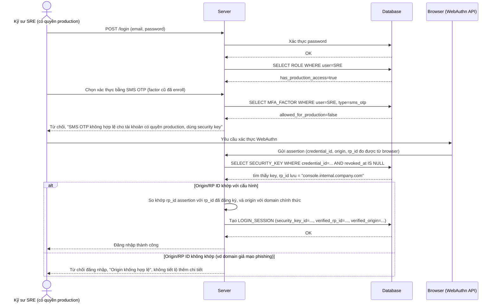

# Enhance sequence — Login with MFA (chặn SMS OTP, bắt buộc WebAuthn, kiểm tra origin/RP ID)

Đây là **enhance** của flow `login-with-mfa` đã có ở base. So với base (chấp nhận mọi factor kể cả SMS OTP), nay tài khoản có `has_production_access` bị chặn hoàn toàn nếu cố dùng SMS OTP dù đã enroll trước đó, và phải xác thực bằng WebAuthn với origin/RP ID được kiểm tra khớp chuẩn. Đáp ứng yêu cầu 1 và yêu cầu 4 của đề bài.

