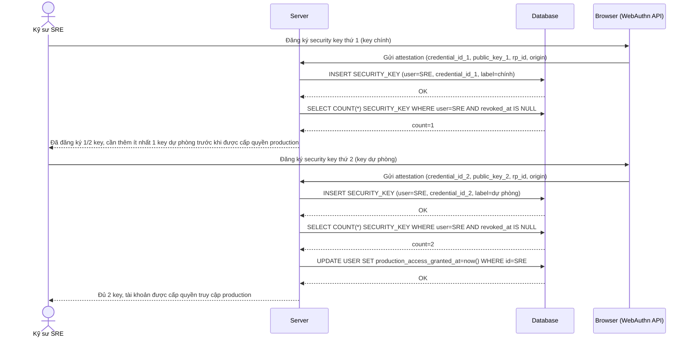

# Enhance sequence — Enroll MFA factor (bắt buộc tối thiểu 2 security key trước khi cấp quyền production)

Đây là **enhance** của flow `enroll-mfa-factor` đã có ở base. So với base (chỉ cần 1 factor bất kỳ là được cấp quyền ngay), nay kỹ sư phải đăng ký ít nhất 2 security key (chính + dự phòng) trước khi tài khoản được cấp `production_access_granted_at`. Đáp ứng yêu cầu 2 của đề bài.

