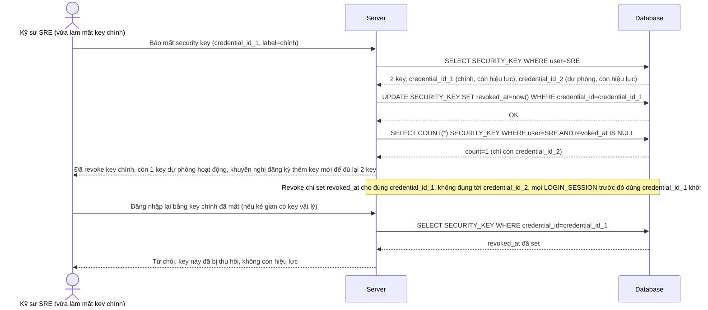

# Enhance sequence — Revoke security key (thu hồi 1 key bị mất, không ảnh hưởng key còn lại)

Đây là **enhance**, flow mới phát sinh từ đề bài — khi 1 security key bị mất/đánh cắp, kỹ sư hoặc admin cần revoke ngay riêng key đó, các key khác của cùng tài khoản vẫn hoạt động bình thường. Đáp ứng yêu cầu 3 của đề bài.

