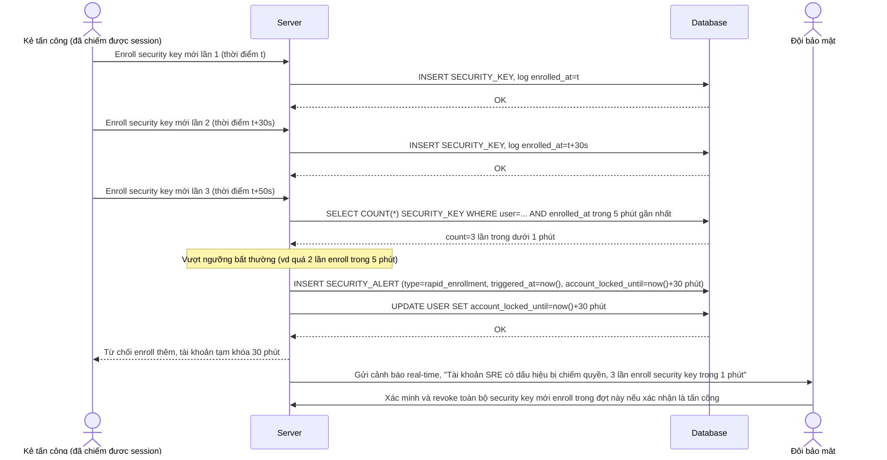

# Enhance sequence — Detect suspicious enrollment (nhiều lần enroll liên tiếp, cảnh báo + khóa tạm thời)

Đây là **enhance**, flow mới phát sinh từ đề bài — hệ thống theo dõi tần suất enroll security key mới, nếu phát hiện nhiều lần enroll liên tiếp trong thời gian ngắn cho cùng 1 tài khoản (dấu hiệu account bị chiếm quyền), tự động cảnh báo và khóa tạm thời. Đáp ứng yêu cầu 5 của đề bài.

