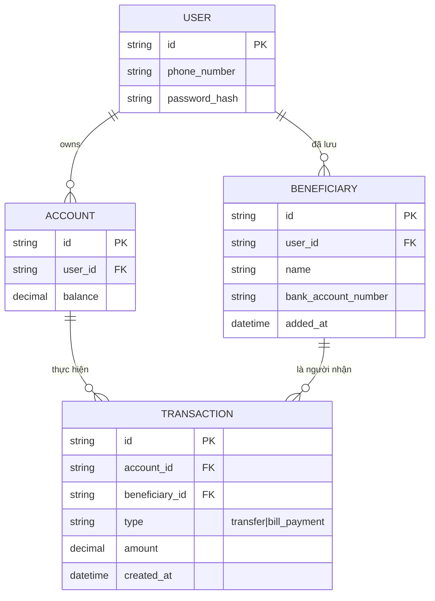

# Base ERD — App ngân hàng số chỉ đăng nhập bằng password, giao dịch không có xác thực thêm

Đây là **base**: trạng thái app ngân hàng số *trước khi* bắt buộc MFA. Suy luận từ đề bài, base đã có `USER`, `ACCOUNT` (số dư), `BENEFICIARY` (người thụ hưởng đã lưu), và `TRANSACTION` cho chuyển tiền/thanh toán hóa đơn. Đăng nhập chỉ cần password, giao dịch được thực hiện ngay sau khi đăng nhập mà không có bất kỳ xác thực bổ sung nào, bất kể số tiền lớn hay nhỏ, thêm beneficiary mới hay không.

