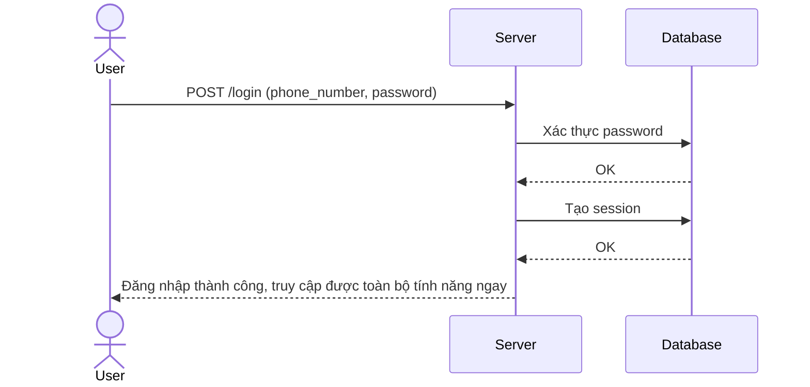

# Base sequence — Login (chỉ password, không có MFA)

Đây là **base**, flow đăng nhập hiện tại: chỉ kiểm tra password, không có bước xác thực bổ sung nào, không có khái niệm enroll MFA. Đây là tiền đề cho yêu cầu 1 của đề bài — hiện tại user có thể dùng toàn bộ app chỉ với password.

