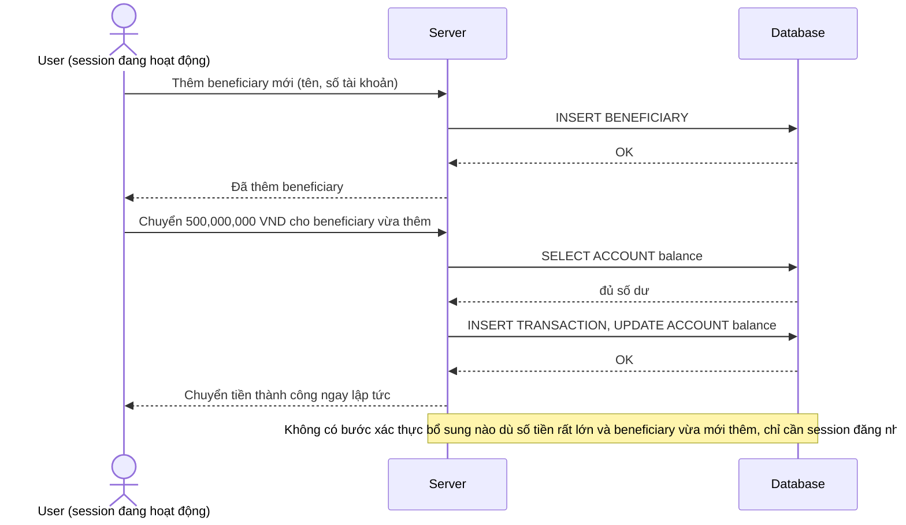

# Base sequence — Transfer money (không có xác thực bổ sung dù số tiền lớn hay thêm beneficiary mới)

Đây là **base**, flow chuyển tiền hiện tại: giao dịch được thực hiện ngay sau khi user xác nhận trong app, không phân biệt số tiền lớn hay nhỏ, không phân biệt chuyển cho beneficiary đã lưu hay beneficiary mới thêm. Đây là tiền đề cho yêu cầu 2 của đề bài.

