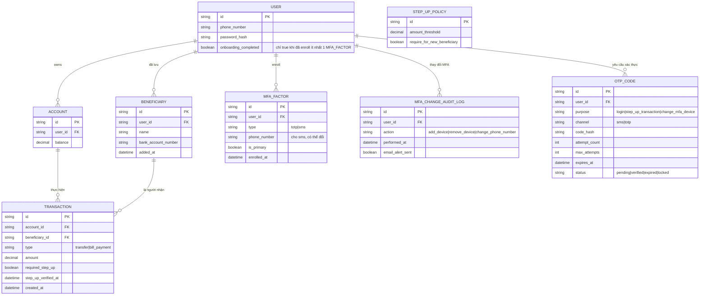

# Enhance ERD — MFA bắt buộc, step-up theo hành vi, OTP có giới hạn, audit thay đổi MFA

Đây là ERD **sau khi** enhance được áp dụng lên base. So với base, thêm các entity/trường sau, ứng trực tiếp với từng yêu cầu:

- `MFA_FACTOR` (mới, bắt buộc có ít nhất 1 trước khi `USER.onboarding_completed`) — đáp ứng yêu cầu 1 (bắt buộc enroll trước khi dùng bất kỳ tính năng nào).
- `STEP_UP_POLICY.amount_threshold` và `TRANSACTION.required_step_up`/`step_up_verified_at` — đáp ứng yêu cầu 2 (step-up MFA khi vượt ngưỡng số tiền hoặc thêm beneficiary mới, dù session còn hạn).
- `OTP_CODE` (mới) với `expires_at`, `attempt_count`, `max_attempts`, `status` — đáp ứng yêu cầu 3 (dùng 1 lần, hết hạn nhanh, giới hạn số lần thử sai).
- `OTP_CODE.channel` hỗ trợ chuyển kênh gửi (sms → totp) khi kênh chính lỗi — đáp ứng yêu cầu 4 (fallback rõ ràng khi SMS thất bại/chậm).
- `MFA_CHANGE_AUDIT_LOG` (mới) — đáp ứng yêu cầu 5 (mọi thay đổi liên quan MFA phải tự yêu cầu xác thực MFA hiện tại và gửi cảnh báo qua email).

