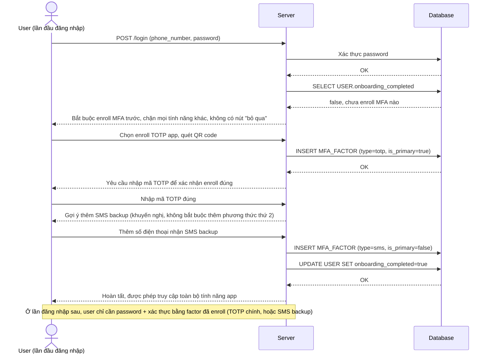

# Enhance sequence — Login (bắt buộc enroll MFA trước khi dùng bất kỳ tính năng nào)

Đây là **enhance** của flow `login` đã có ở base. So với base (chỉ password, không MFA), nay user mới không được phép "bỏ qua để sau" — phải hoàn tất enroll ít nhất 1 phương thức MFA (TOTP hoặc SMS backup) ngay sau khi đăng nhập lần đầu, trước khi truy cập bất kỳ tính năng nào của app. Đáp ứng yêu cầu 1 của đề bài.

