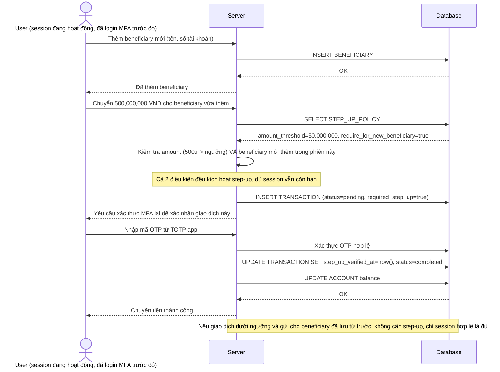

# Enhance sequence — Transfer money (step-up MFA khi vượt ngưỡng hoặc thêm beneficiary mới)

Đây là **enhance** của flow `transfer-money` đã có ở base. So với base (chuyển tiền ngay không cần xác thực thêm), nay giao dịch vượt ngưỡng số tiền hoặc chuyển cho beneficiary mới thêm phải yêu cầu xác thực MFA lại, dù session đăng nhập còn hạn. Đáp ứng yêu cầu 2 của đề bài.

