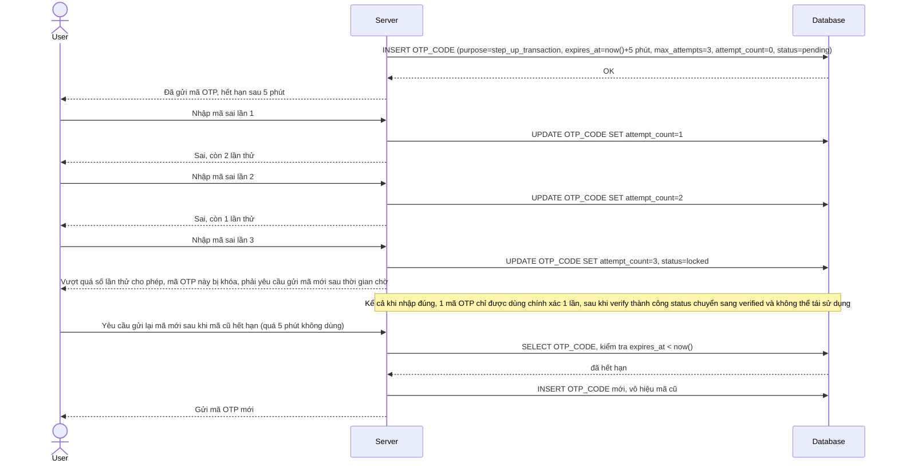

# Enhance sequence — Verify OTP with retry limit (dùng 1 lần, hết hạn nhanh, giới hạn thử sai)

Đây là **enhance**, flow mới phát sinh từ đề bài mô tả chi tiết vòng đời của 1 mã OTP dùng chung cho cả `login` và `transfer-money` (step-up) — mã chỉ dùng được 1 lần, hết hạn sau thời gian ngắn, và bị tạm khóa nếu nhập sai quá số lần cho phép. Đáp ứng yêu cầu 3 của đề bài.

