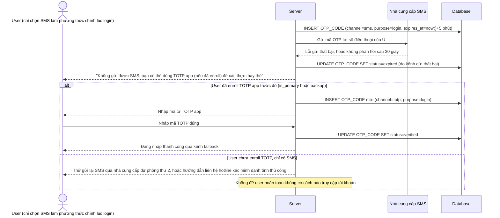

# Enhance sequence — SMS OTP fallback to TOTP (không để user bị kẹt ngoài tài khoản)

Đây là **enhance**, flow mới phát sinh từ đề bài — khi gửi OTP qua SMS thất bại hoặc chậm, hệ thống cung cấp phương án fallback rõ ràng sang TOTP app thay vì để user bị kẹt hoàn toàn ngoài tài khoản. Đáp ứng yêu cầu 4 của đề bài.

