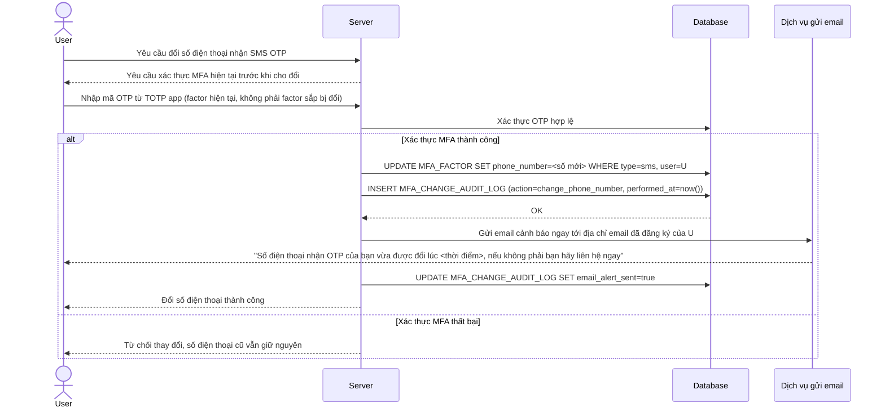

# Enhance sequence — Update MFA device (tự yêu cầu MFA hiện tại + cảnh báo email ngay)

Đây là **enhance**, flow mới phát sinh từ đề bài — mọi thay đổi liên quan tới MFA (thêm/xóa thiết bị, đổi số điện thoại nhận OTP) phải tự nó yêu cầu xác thực MFA hiện tại trước khi thực hiện, và gửi cảnh báo qua email ngay khi thay đổi hoàn tất. Đáp ứng yêu cầu 5 của đề bài.

