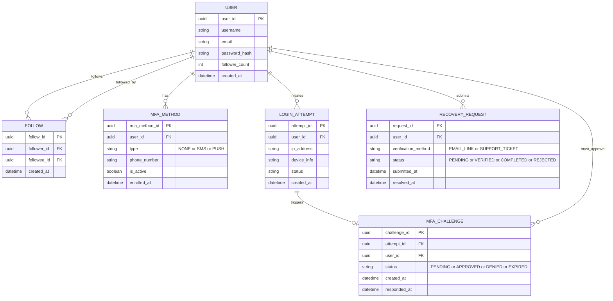

# ERD — Base (trước khi áp enhance)

Đây là **base**: mô hình dữ liệu mạng xã hội trước khi áp dụng chính sách MFA nâng cao cho creator lớn. Chỉ suy luận phần liên quan mật thiết tới enhance: người dùng, quan hệ follow (để biết mức độ ảnh hưởng), phương thức MFA hiện có (SMS/push đơn giản, chưa có WebAuthn/TOTP bắt buộc), lịch sử đăng nhập, challenge MFA, và một luồng phục hồi tài khoản chuẩn (chưa phân tier ưu tiên). Không suy diễn thêm các module không liên quan (đăng bài, billing, nhắn tin...).

**Ghi chú suy luận:**
- `USER.follower_count` và `FOLLOW` phải tồn tại trước — enhance cần biết "tài khoản có ảnh hưởng lớn" để áp chính sách MFA mạnh hơn.
- `MFA_METHOD.type` ở base chỉ gồm `NONE`, `SMS`, `PUSH` — chưa có `WEBAUTHN`/`TOTP`, vì enhance yêu cầu "buộc chuyển từ SMS hoặc không có MFA sang WebAuthn/TOTP".
- Đã có `PUSH` như một lựa chọn MFA vì enhance mô tả rõ "thay vì chỉ một nút Approve đơn giản" — tức UI push approve đơn giản đã tồn tại trước, enhance chỉ nâng cấp nó.
- `RECOVERY_REQUEST` ở base chỉ có 1 luồng duy nhất, không phân biệt tier — enhance thêm phân tier ưu tiên cho creator lớn.
