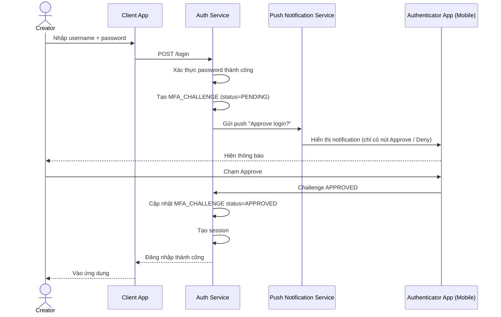

# Sequence Diagram — Base: Login với MFA Push Approve

Đây là **base**, flow đăng nhập kèm MFA push hiện có. Flow này được chọn vì nó chính là mục tiêu bị tấn công "MFA fatigue" mà enhance phải phòng chống — ở base, chưa có giới hạn tần suất gửi push, chưa hiển thị ngữ cảnh (vị trí/thiết bị/thời gian), và nút Approve chỉ là một thao tác chạm đơn giản, rất dễ bấm nhầm khi bị dồn dập.

**Điểm yếu ở base (tiền đề cho enhance):** không giới hạn số request MFA gửi liên tiếp, không hiển thị vị trí/thiết bị/thời gian trong notification, không có bước xác nhận có chủ đích (number matching) — kẻ tấn công có password bị lộ có thể spam login để gây MFA fatigue.
