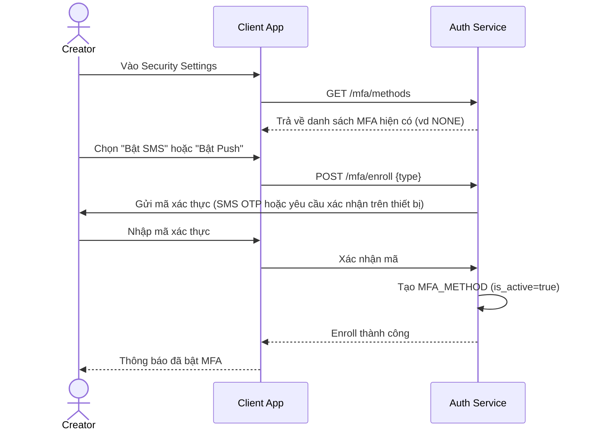

# Sequence Diagram — Base: Đăng ký MFA (tự nguyện)

Đây là **base**, flow người dùng tự nguyện bật MFA (SMS hoặc Push) trong cài đặt bảo mật, không có ràng buộc nào dựa trên follower_count. Flow này được chọn làm nền so sánh vì enhance sẽ biến việc nâng cấp MFA từ "tự nguyện" thành "bắt buộc" đối với tài khoản ảnh hưởng lớn.

**Đặc điểm base:** hoàn toàn tự chọn, không có ngưỡng follower nào kích hoạt, không có deadline/grace period.
