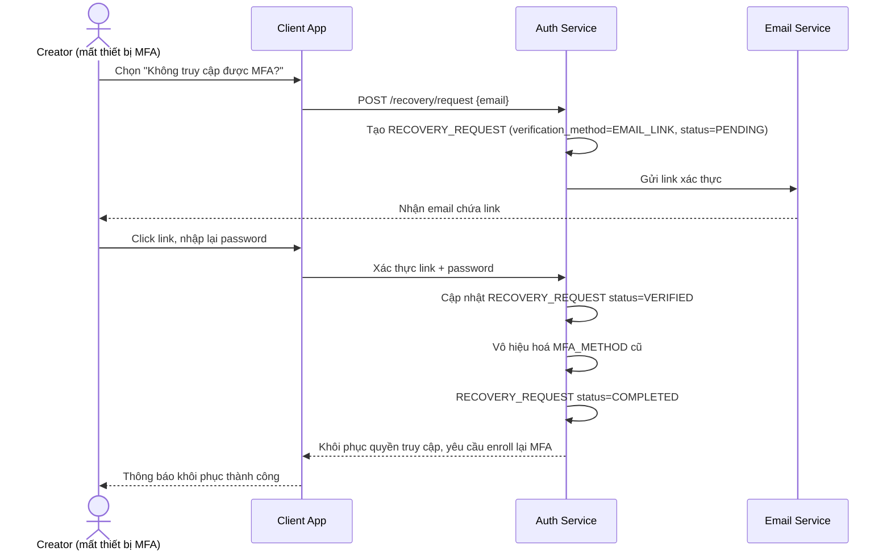

# Sequence Diagram — Base: Phục hồi tài khoản khi mất MFA

Đây là **base**, flow phục hồi tài khoản chuẩn khi người dùng mất thiết bị MFA — duy nhất một đường xử lý, áp dụng như nhau cho mọi tài khoản bất kể follower_count. Flow này được chọn làm nền vì enhance sẽ tách riêng một nhánh phục hồi ưu tiên dành cho creator lớn.

**Đặc điểm base:** một quy trình duy nhất cho tất cả người dùng, không có bước xác minh danh tính tăng cường, không có kênh hỗ trợ ưu tiên riêng.
