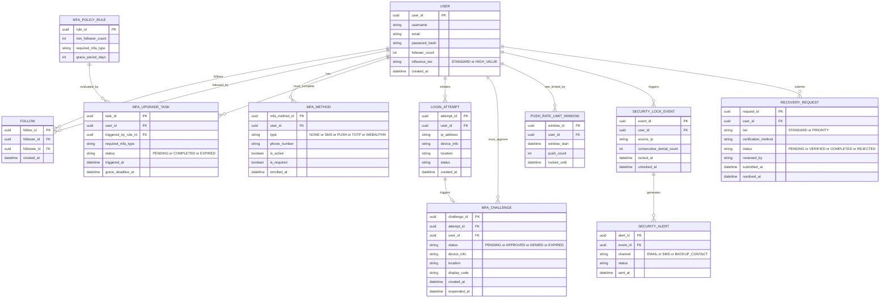

# ERD — Enhance (sau khi áp dụng đề bài)

Đây là **enhance**: mô hình dữ liệu sau khi áp toàn bộ yêu cầu — nâng cấp MFA tự động theo ngưỡng ảnh hưởng, chống MFA fatigue, và phục hồi khẩn cấp phân tier. So với base, các entity mới/thay đổi: `USER` thêm `influence_tier`; `MFA_METHOD` mở rộng type (`TOTP`/`WEBAUTHN`) và `is_required`; thêm `MFA_POLICY_RULE` + `MFA_UPGRADE_TASK` (ngưỡng follower → bắt buộc nâng cấp); `MFA_CHALLENGE` thêm ngữ cảnh (`device_info`, `location`, `display_code` cho number matching); thêm `PUSH_RATE_LIMIT_WINDOW` (giới hạn tần suất push); thêm `SECURITY_LOCK_EVENT` + `SECURITY_ALERT` (phát hiện tấn công → khoá nguồn + cảnh báo kênh độc lập); `RECOVERY_REQUEST` thêm `tier` và `reviewed_by` (phục hồi ưu tiên cho creator lớn).

