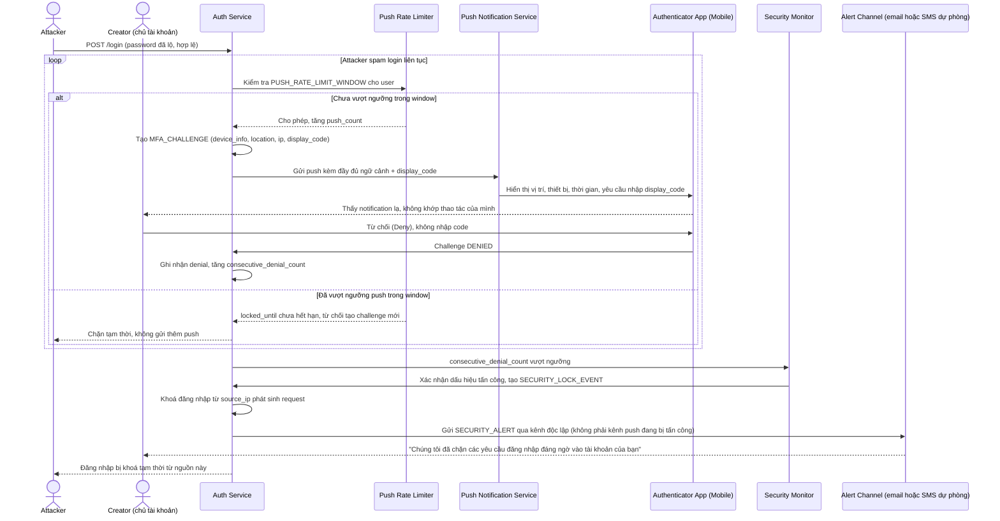

# Sequence Diagram — Enhance: Login với MFA Push Approve (chống fatigue)

Đây là **enhance** của flow `login-mfa-push-approve` ở base. So với base, flow này thay đổi ở 3 điểm: (1) mỗi push đều mang đủ ngữ cảnh (vị trí, thiết bị, thời gian) kèm number matching thay vì nút Approve đơn giản, (2) số push gửi liên tiếp trong khoảng thời gian ngắn bị giới hạn, request mới sau ngưỡng sẽ tự động bị khoá, (3) khi phát hiện một chuỗi từ chối liên tiếp — dấu hiệu tấn công — hệ thống tự động khoá đăng nhập từ nguồn phát sinh và cảnh báo chủ tài khoản qua kênh độc lập, không chờ họ tự nhận ra.

**So với base:** thêm bước kiểm tra `Push Rate Limiter` trước mỗi challenge, thêm ngữ cảnh + number matching trong nội dung push, và thêm nhánh phát hiện tấn công (`Security Monitor`) tự động khoá + cảnh báo độc lập — không còn chỉ là "gửi push, chờ 1 cú chạm Approve" như base.
