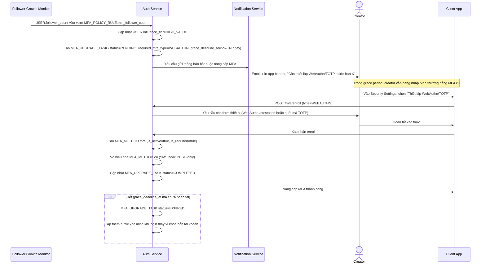

# Sequence Diagram — Enhance: Đăng ký MFA (bắt buộc nâng cấp theo ngưỡng ảnh hưởng)

Đây là **enhance** của flow `mfa-enroll` ở base. So với base, việc nâng cấp MFA không còn hoàn toàn tự nguyện: khi follower_count vượt ngưỡng trong `MFA_POLICY_RULE`, hệ thống tự động tạo yêu cầu bắt buộc chuyển sang WebAuthn/TOTP, có thông báo trước và grace period để không đột ngột khoá quyền truy cập của creator đang hoạt động bình thường.

**So với base:** trigger không còn là hành động tự nguyện của user mà là một job hệ thống (`Follower Growth Monitor`) phát hiện ngưỡng ảnh hưởng bị vượt, kèm `grace_deadline_at` và nhánh xử lý khi hết hạn — thay vì chỉ có 1 luồng enroll đơn giản.
