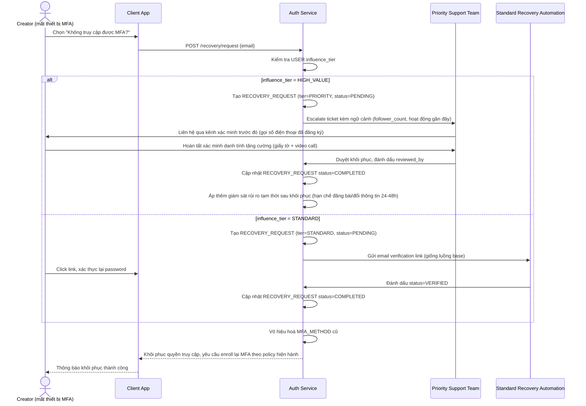

# Sequence Diagram — Enhance: Phục hồi tài khoản (tiered — ưu tiên cho creator lớn)

Đây là **enhance** của flow `account-recovery` ở base. So với base — nơi mọi người dùng đi chung một luồng email verification — enhance tách riêng một nhánh ưu tiên (`PRIORITY`) cho tài khoản `influence_tier=HIGH_VALUE`, với xác minh danh tính tăng cường và giám sát chống lạm dụng sau khôi phục, nhằm cân bằng giữa tốc độ khôi phục và rủi ro kẻ tấn công lợi dụng kênh ưu tiên.

**So với base:** thêm nhánh rẽ theo `influence_tier` — creator lớn được xử lý qua `Priority Support Team` với xác minh danh tính tăng cường và giám sát chống lạm dụng sau khôi phục, thay vì đi chung một luồng email-link như mọi tài khoản khác ở base.
