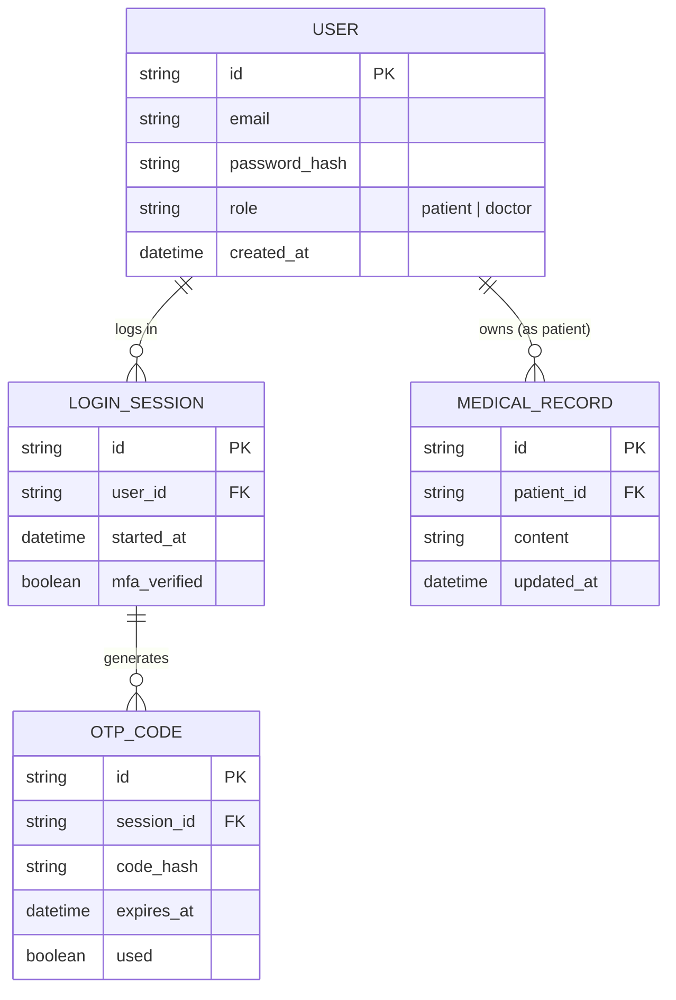

# Base ERD — Nền tảng telehealth trước khi có adaptive MFA

Đây là **base**: mô hình dữ liệu suy luận từ ngữ cảnh đề bài, thể hiện trạng thái hệ thống **trước khi** có MFA thích ứng theo rủi ro. Đề bài nói "MFA bắt buộc cho bác sĩ/nhân viên y tế" như một vai trò/bối cảnh có sẵn, và mô tả việc giảm ma sát cho bệnh nhân — nên base cần đủ: người dùng phân vai trò (bệnh nhân/bác sĩ), phiên đăng nhập, mã OTP xác thực MFA, và hồ sơ bệnh án để giải thích vì sao bác sĩ/bệnh nhân cần bảo vệ chặt. Ở base, MFA là **bắt buộc cố định mọi lần đăng nhập cho tất cả vai trò** — chưa có khái niệm điểm rủi ro, thiết bị/vị trí đã biết, hay log lý do quyết định; những thứ đó là phần enhance.

