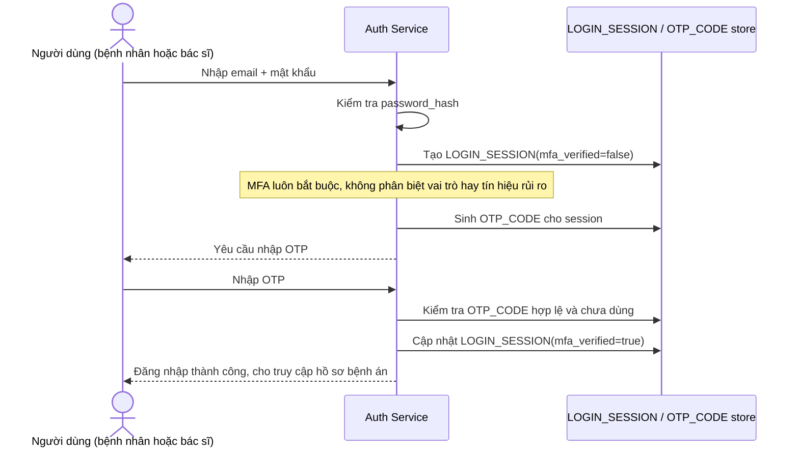

# Base sequence — Login với MFA cố định

Đây là **base**, flow "Đăng nhập" ở trạng thái hiện tại — sau khi đúng mật khẩu, hệ thống luôn yêu cầu OTP với mọi vai trò, mọi lần, không phân biệt rủi ro. Flow này liên quan mật thiết tới enhance vì toàn bộ yêu cầu của đề bài là làm cho bước "yêu cầu MFA hay không" trở nên thích ứng theo rủi ro thay vì cố định như ở đây.

