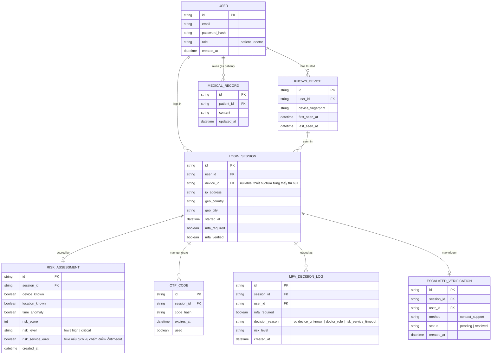

# Enhance ERD — sau khi có adaptive MFA theo rủi ro

Đây là ERD **sau khi** enhance được áp dụng lên base. So với base, có 5 nhóm thay đổi/entity mới, ứng trực tiếp với các yêu cầu trong đề bài:

- `LOGIN_SESSION` (sửa) — thêm `device_id`, `ip_address`, `geo_country`, `geo_city` để ghi nhận tín hiệu ngữ cảnh của lần đăng nhập.
- `KNOWN_DEVICE` (mới) — thiết bị đã từng đăng nhập thành công của một user, dùng để so sánh "thiết bị đã biết hay chưa".
- `RISK_ASSESSMENT` (mới) — kết quả tính điểm rủi ro cho một session: thiết bị/vị trí đã biết chưa, có bất thường giờ truy cập không, điểm số và mức rủi ro, kèm cờ báo lỗi/timeout của dịch vụ tính rủi ro để phục vụ fail-safe.
- `MFA_DECISION_LOG` (mới) — log bắt buộc mọi quyết định yêu cầu/miễn MFA kèm lý do, phục vụ audit compliance.
- `ESCALATED_VERIFICATION` (mới) — yêu cầu xác minh mạnh hơn (liên hệ hỗ trợ) khi rủi ro cao bất thường, thay vì chỉ hỏi lại OTP.

