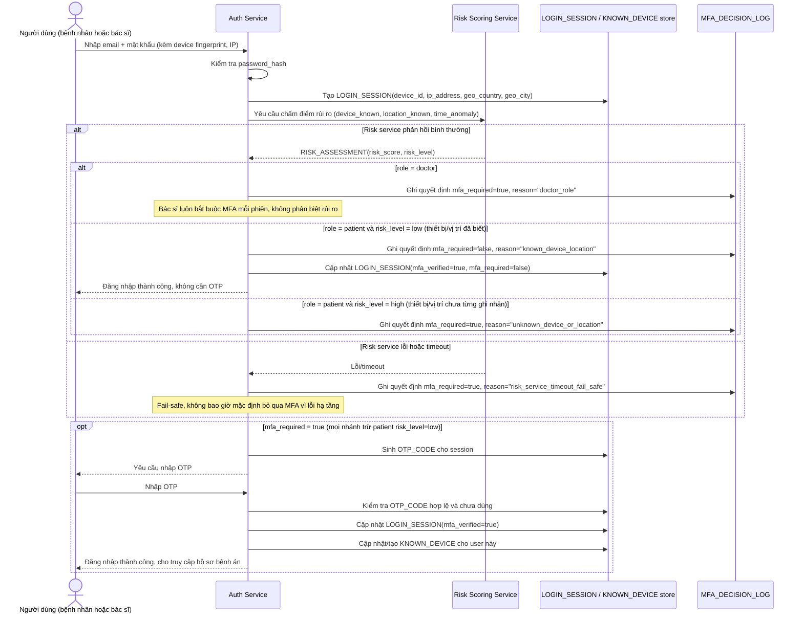

# Enhance sequence — Login với adaptive MFA theo rủi ro

Đây là **enhance**, cùng flow "Đăng nhập" đã có ở base nhưng nay thay đổi hoàn toàn: sau khi đúng mật khẩu, hệ thống tính điểm rủi ro (thiết bị, vị trí, giờ truy cập) rồi mới quyết định có yêu cầu OTP hay không, thay vì luôn hỏi OTP như base. Bác sĩ vẫn luôn bị yêu cầu MFA mỗi phiên bất kể rủi ro (giữ nguyên hành vi base cho vai trò này), còn bệnh nhân chỉ bị hỏi khi thiết bị/vị trí chưa từng ghi nhận. Nếu dịch vụ chấm điểm rủi ro lỗi/timeout, hệ thống fail-safe về yêu cầu MFA đầy đủ. Mọi quyết định đều được log lại lý do.

