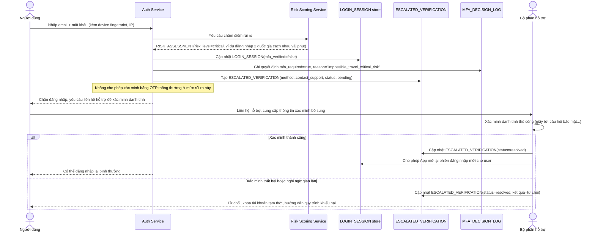

# Enhance sequence — Chặn và xác minh mạnh hơn khi rủi ro cao bất thường

Đây là **enhance**, flow hoàn toàn mới, phát sinh từ enhance — chưa tồn tại ở base (base không có khái niệm điểm rủi ro nên không thể phân biệt rủi ro cao bất thường). Đáp ứng yêu cầu: khi điểm rủi ro cao bất thường (ví dụ đăng nhập từ hai quốc gia cách nhau vài phút), phải chặn và yêu cầu xác minh bổ sung mạnh hơn thay vì chỉ hỏi lại OTP thông thường.

