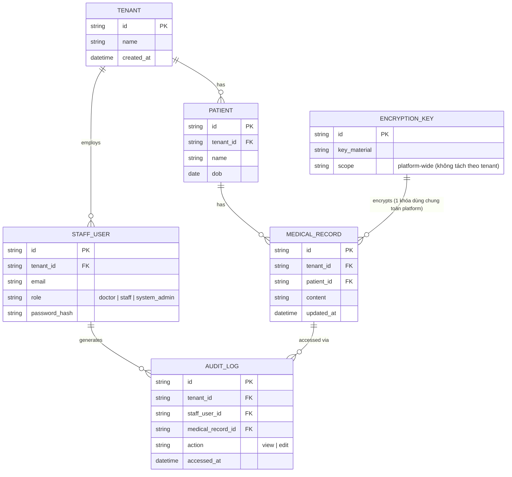

# Base ERD — SaaS đa phòng khám trước khi siết cách ly nghiêm ngặt

Đây là **base**: mô hình dữ liệu suy luận từ ngữ cảnh đề bài, thể hiện trạng thái hệ thống **trước khi** áp các lớp bảo vệ nghiêm ngặt. Đề bài đối chiếu trực tiếp với "chỉ cột `tenant_id` trong shared schema" (yêu cầu 1) — nên base được suy luận là một SaaS đa tenant kiểu shared schema thông thường: mọi phòng khám (tenant) chia sẻ cùng database/schema, phân biệt dữ liệu bằng cột `tenant_id`, dùng **một khóa mã hóa dùng chung cho toàn platform** (chưa tách theo tenant — đối lập với yêu cầu 2), đã có audit log cơ bản khi xem hồ sơ bệnh nhân nhưng **chưa được cách ly/giới hạn xem theo tenant** (đối lập với yêu cầu 4, admin hệ thống có thể xem log của mọi tenant). Base **chưa có** quy trình xóa dữ liệu triệt để theo tenant (yêu cầu 3) và **chưa có** pipeline AI/phân tích ẩn danh hóa (yêu cầu 5) — những phần này là enhance hoàn toàn mới.

