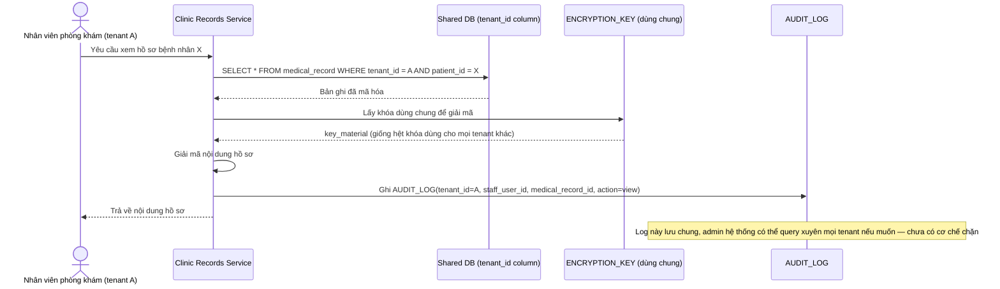

# Base sequence — Xem hồ sơ bệnh nhân (shared schema, chưa cách ly nghiêm ngặt)

Đây là **base**, flow "Xem hồ sơ bệnh nhân" ở trạng thái hiện tại — lọc theo `tenant_id` trong shared schema, giải mã bằng khóa dùng chung toàn platform, ghi audit log nhưng log này không bị giới hạn xem theo tenant. Flow này liên quan mật thiết tới enhance vì toàn bộ 4 yêu cầu đầu của đề bài (mô hình cách ly, khóa mã hóa riêng, xóa dữ liệu, audit log cách ly) đều nhằm siết chặt đúng những điểm yếu ở đây.

