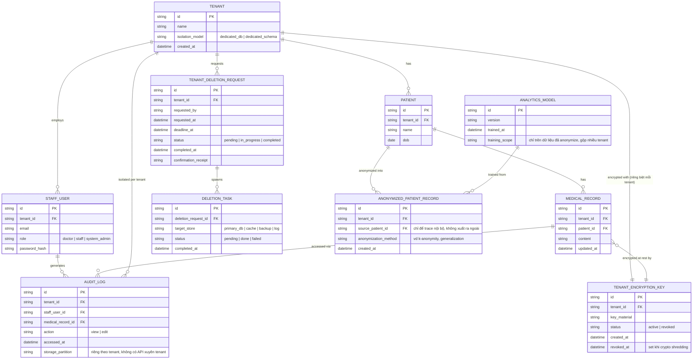

# Enhance ERD — sau khi có cách ly nghiêm ngặt theo tenant

Đây là ERD **sau khi** enhance được áp dụng lên base. So với base, có 5 nhóm thay đổi/entity mới, ứng trực tiếp với 5 yêu cầu trong đề bài:

- `TENANT` (sửa) — thêm `isolation_model` (database riêng hoặc schema riêng theo tenant, không còn chỉ cột `tenant_id` trong shared schema).
- `TENANT_ENCRYPTION_KEY` (mới, thay cho `ENCRYPTION_KEY` dùng chung) — mỗi tenant một khóa riêng, hỗ trợ crypto shredding khi cần huỷ dữ liệu một tenant mà không ảnh hưởng tenant khác.
- `TENANT_DELETION_REQUEST` + `DELETION_TASK` (mới) — theo dõi tiến trình xóa dữ liệu triệt để trên từng hệ thống lưu trữ (DB chính, cache, backup, log), có xác nhận hoàn tất trong khung thời gian xác định.
- `AUDIT_LOG` (sửa) — vẫn gắn `tenant_id` như base nhưng nay được lưu/truy vấn tách biệt theo tenant, không admin hệ thống thông thường nào truy vấn xuyên tenant được.
- `ANONYMIZED_PATIENT_RECORD` + `ANALYTICS_MODEL` (mới) — dữ liệu đã ẩn danh hóa dùng để huấn luyện mô hình phân tích xu hướng, tách khỏi dữ liệu định danh gốc.

